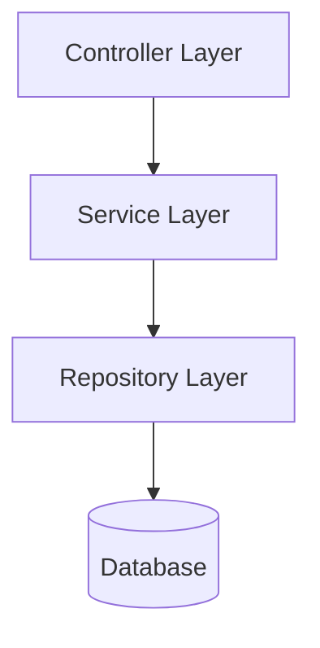

# Prosnokorta-API (Online Quiz Management System)

## 📌 Project Overview

The **Prosnokorta** is a robust Java-based web application developed as part of the **Object-Oriented Programming (OOP)** course project. It serves as the backbone for managing quizzes, questions, students, and results, adhering to strict software engineering principles.

---

## 🏗 Backend Architecture Style

We follow a **Layered Architecture (MVC-inspired)** to ensure separation of concerns and maintainability.



Each layer has a distinct responsibility:
1.  **Controller Layer**: Handles HTTP requests and responses.
2.  **Service Layer**: Contains business logic and transactional boundaries.
3.  **Repository Layer**: Abstraction for data access (talks to the database).
4.  **Database**: Persistent storage.

---

## � Backend Package Structure

The project follows a standard industry-grade package structure:

```
com.quiz
 ├── controller   # REST Endpoints
 ├── service      # Business Logic Interfaces
 │    └── impl    # Service Implementations
 ├── repository   # Data Access Interfaces
 ├── model        # JPA Entities (Domain Model)
 ├── dto          # Data Transfer Objects
 └── config       # Configuration Classes
```

---

## 🧱 Backend Layer Responsibilities

### 3.1 Controller Layer
*   **Responsibility**: Accept HTTP requests, validate input, call service methods, and return responses.
*   **Characteristics**: Thin, no business logic.

```java
@RestController
@RequestMapping("/api/student")
public class StudentController {
    // Delegates to Service Layer
}
```

### 3.2 Service Layer (OOP Core)
*   **Responsibility**: Core business logic, transactional management.
*   **OOP Principles**: Heavy use of **Abstraction** and **Polymorphism**.

```java
public interface QuizService {
    int calculateScore(...);
}

@Service
public class QuizServiceImpl implements QuizService {
    // Implementation details
}
```

### 3.3 Repository Layer
*   **Responsibility**: Database communication. (No business logic here).
*   **Technology**: Spring Data JPA.

```java
public interface QuizRepository extends JpaRepository<Quiz, Long> {
}
```

---

## 🏛 Entity Design (Domain Model)

Entities represent real-world objects and use **Inheritance** and **Encapsulation** effectively.

### Hierarchy
*   **User** (Abstract Base Class)
    *   **Admin** (Extends User)
    *   **Student** (Extends User)
*   **Subject**
*   **Quiz**
*   **Question**
*   **Result**

### OOP Principles Applied
*   **Abstraction**: `User` is abstract; cannot be instantiated directly.
*   **Inheritance**: `Admin` and `Student` inherit common fields (id, name, email) from `User`.
*   **Encapsulation**: All fields are `private` with public getters/setters.
*   **Polymorphism**: Used in service interfaces and potential user processing.

---

## � Database Design Principles

### 5.1 Normalization
*   Ensures no duplicate data.
*   Maintains data integrity.

### 5.2 Relationships
*   **One Subject → Many Quizzes**
*   **One Quiz → Many Questions**
*   **One Student → Many Results**

Mapped using JPA annotations:
```java
@OneToMany(mappedBy = "...")
@ManyToOne
```

---

## � Backend Design Principles

We adhere to SOLID principles to ensure code quality.

### 6.1 Single Responsibility Principle (SRP)
*   **Controller** handles HTTP.
*   **Service** handles Logic.
*   **Repository** handles Data.
*   *Result*: No "God Classes".

### 6.2 Open–Closed Principle (OCP)
The system is designed to be extended without modifying existing code.
*   *Example*: Adding a new `QuizType` or `UserRole` does not break the core logic.

### 6.3 Dependency Injection (DI)
We use Spring's Inversion of Control (IoC) to manage dependencies, promoting **loose coupling**.

```java
@Autowired
private final QuizService quizService; // Constructor Injection
```

### 6.4 Don’t Repeat Yourself (DRY)
*   Shared logic is centralized in Service methods.
*   Base classes reduce code duplication in Entities.

---

## 🔒 Security by Design
Even without complex security frameworks like Spring Security (in the initial phase), the design is secure:
*   **Server-Side Validation**: Never trust the client.
*   **Secure Data Flow**: Correct answers are calculated on the backend and never sent to the frontend during the quiz.

---

## 📡 API Design & Endpoints

### Overview
*   **Base URL**: `/api`
*   **Style**: RESTful, JSON-based, Stateless
*   **Architecture**: Backend-controlled logic

### 🔐 Part 1: Authentication APIs (Common)
Mandatory endpoints for user access.

| Method | Endpoint | Purpose |
| :--- | :--- | :--- |
| `POST` | `/api/auth/register` | Create a new student account (Used by Frontend Register page) |
| `POST` | `/api/auth/login` | Authenticate user & identify role (Admin/Student) |
| `POST` | `/api/auth/logout` | End session (Logical logout) |

### 🛠 Part 2: Admin APIs
Admin controls content (subjects, quizzes, questions), not users’ answers.

#### 🧠 Subject Management
| Method | Endpoint | Purpose |
| :--- | :--- | :--- |
| `POST` | `/api/admin/subjects` | Add new quiz subject (e.g., Math, ICT) |
| `GET` | `/api/admin/subjects` | View all subjects (Needed before creating quizzes) |

#### 📝 Quiz Management
| Method | Endpoint | Purpose |
| :--- | :--- | :--- |
| `POST` | `/api/admin/quizzes` | Create a quiz under a subject & set duration |
| `GET` | `/api/admin/quizzes/{subjectId}` | View quizzes of a specific subject |

#### ❓ Question Management
| Method | Endpoint | Purpose |
| :--- | :--- | :--- |
| `POST` | `/api/admin/quizzes/{quizId}/questions` | Add MCQ question to quiz |
| `GET` | `/api/admin/quizzes/{quizId}/questions` | Preview quiz questions (Admin view) |

#### 📊 Result Monitoring
| Method | Endpoint | Purpose |
| :--- | :--- | :--- |
| `GET` | `/api/admin/results` | View all student quiz results |
| `GET` | `/api/admin/results/quiz/{quizId}` | View performance of students for one quiz |

### 🎓 Part 3: Student APIs
Students consume quizzes and view their own results.

#### 📚 Subject & Quiz Access
| Method | Endpoint | Purpose |
| :--- | :--- | :--- |
| `GET` | `/api/student/subjects` | Show subject list on dashboard |
| `GET` | `/api/student/quizzes/{subjectId}` | Student selects quiz to attempt |

#### 🧪 Quiz Attempt Flow
| Method | Endpoint | Purpose |
| :--- | :--- | :--- |
| `GET` | `/api/student/quiz/{quizId}` | **Start Quiz**: Fetch metadata & questions (WITHOUT correct answers) |
| `POST` | `/api/student/quiz/{quizId}/submit` | **Submit Quiz**: Backend calculates score & stores result |

#### 📈 Result Access
| Method | Endpoint | Purpose |
| :--- | :--- | :--- |
| `GET` | `/api/student/results` | Student views past quiz scores |
| `GET` | `/api/student/results/{resultId}` | View detailed performance of one quiz |

### 🔹 Optional API Support
*   `PUT /api/student/profile` - Update Profile
*   `DELETE /api/admin/quizzes/{quizId}` - Delete Quiz

---

## ⚠️ Error Handling Strategy
*   Global Exception Handling using `@ControllerAdvice`.
*   Returns proper **HTTP Status Codes** (200, 400, 404, 500).
*   Friendly error messages, avoiding stack trace exposure to clients.

---

## 🎓 Academic Justification

> "We followed a layered backend architecture with strong separation of concerns, ensuring clean OOP design, testability, and maintainability."

This architecture demonstrates a strong grasp of:
*   **Software Architecture** (Layered/MVC)
*   **Object-Oriented Design** (Inheritance, Polymorphism, Encapsulation)
*   **Clean Code Principles** (SOLID, DRY)

---

## ⚙️ Setup & Run Instructions

1.  **Clone the repository**
    ```bash
    git clone https://github.com/your-username/online-quiz-system.git
    ```
2.  **Configuration**
    *   Update `src/main/resources/application.properties` with your MySQL/H2 database credentials.
3.  **Build & Run**
    *   Import into IntelliJ IDEA / Eclipse.
    *   Run `OnlineQuizApplication.java`.

---

## 🔗 Repository Links
- **Web Frontend:** [https://github.com/FardinMahadi/Prosnokorta-Web](https://github.com/FardinMahadi/QuizMaster-Web)
- **Mobile Frontend (React Native):** [https://github.com/FardinMahadi/Prosnokorta-Mobile](https://github.com/FardinMahadi/QuizMaster-Mobile)
- **Backend (API):** [https://github.com/FardinMahadi/Prosnokorta-API](https://github.com/FardinMahadi/QuizMaster-API)

---

## 👥 Team Members

- **Mahadi Hasan Fardin** (@FardinMahadi) — *Team Leader*
**Department:** ICT  
**University:** Comilla University
